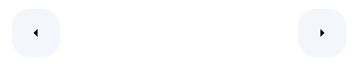
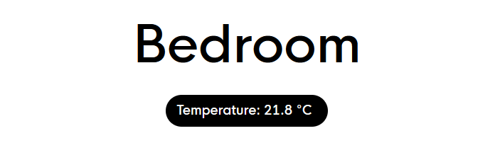
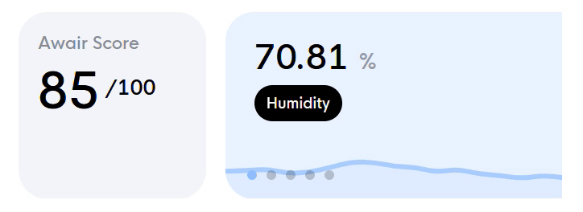
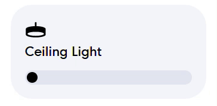
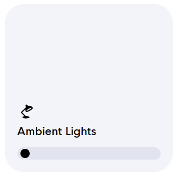
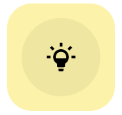
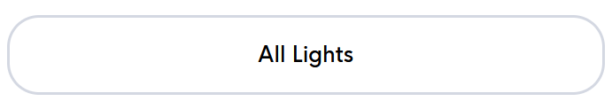
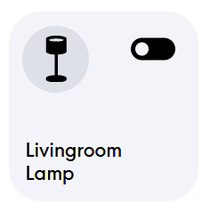
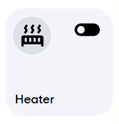

# HA Dashboard
This is my adaptation of the Rounded Dashboard created by LE0N on the Home Assistant forums. The original theme & styling can be found here: [Rounded Dashboard](https://community.home-assistant.io/t/rounded-dashboard-guide/543043)

---

#### Requirements:

You will need to add the HACS plugin and install some custom cards in order for this to work.

* Card-mod
* Button-card
* My-slider-v2 (My Cards Bundle)
* Swipe card
* Layout card

My custom theme file: [Rounded.yaml](/themes/Rounded.yaml)

The font used is HK-nova, which needs to be manually installed in /www/fonts/ directory: [HK-nova](https://hanken.co/en-gb/products/hk-nova)

To use the font, copy the CSS file here: [fontstyle.css](/fontstyle.css) to the /www/ directory and in HA, enable advanced mode in your profile and use the edit menu in your dashboard to add the CSS file as resource.

And you will need to include the following in your configuration.yaml:
```
frontend:
  themes: !include_dir_merge_named themes/
```

---

#### Details:

I've made various tweaks to the styling to suit my preferences, and re-designed some of the cards and created my own in a way that matches the original theme. All of my dashboards make use of the layout card addon through HACS to control card placement and configure the dashboard views to a vertical layout where cards only occupy one column, so this is best suited to portrait view. Some cards may need the placement and padding of elements moved around and adjusted depending on screen size as they are not dynamic.


---
---

## Cards & Elements

### Page view button card:
Allows switching between dashboard views, they can be resized and aligned as required. I typically place them at the very top of the dashboard when I use them.

[YAML Code](/page-view-buttons.yaml)



---

### Dashboard header card:
The header is the centerpiece of each dashboard view. The name, as well as the contents of the pill below can be customized.

[YAML Code](/dashboard-header.yaml)



---

### Air quality swiper card:
A swipable multi-card view with multiple sensor cards showing info like humidity, CO2 and dust levels from an air quality sensor. The first card in the swipe view is a custom card showing air quality score, this can be used with something like an Awair or Amazon AQM sensor. In the example, I have my awair air quality score showcased here.

[YAML Code](/air-quality-swiper.yaml)



---

### Light slider cards:
Two styles, for a standard yellow/white light and for a full colour light. The slider controls brightness, and press-and-hold action on the card brings up the more-info panel for the light entity.

You can use 'aspect_ratio: 1/1' to make the card square. Eg.
```
type: custom:button-card
name: Ambient Lights
aspect_ratio: 1/1
icon: hue:desk-lamp
entity: light.bedroom_ambient_lights
tap_action:
  action: toggle
  ...
```

[YAML Code](/light-card-normal.yaml)




[YAML Code](/light-card-colour.yaml)



In my card layout, light sliders are always placed next to scene button cards in a grid card. Below is an example of the lighting grid for one room.

[YAML Code](/full-light-grid-card.yaml)


---

### Light scene button cards:
Simple custom button cards with tap_actions defined to activate a light scene. I use philips hue, so they call the 'hue.activate_scene' service.

[YAML Code](/lighting-scene-button.yaml)



---

### 'More information' button card:
Can be used to show more-info about an entity or to link to a subview. I mostly use these buttons as navigation to a subview containing a full list of entities. 

The below example is configured to go to a hidden subview of the dashboard containing all my smart-lights.

[YAML Code](/more-information-button.yaml)




---

### Switch button cards:
Simple customizable toggle buttons for controlling switch entities or entities with different states. I use these primarily with my smart plugs and outlets. 

These cards also come in 2 different styles with only a minor difference. The smart plugs connected to lamps or light-devices will be yellow when in the 'on' state, and the plugs connected to standard appliances will be green when in the 'on' state.

[YAML Code](/switch-button-light.yaml)



[YAML Code](/switch-button-device.yaml)

